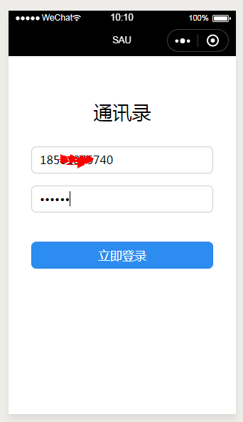
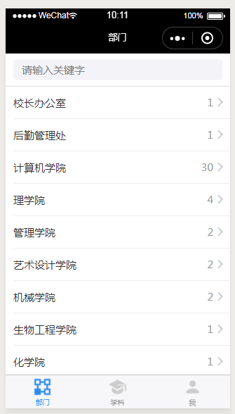
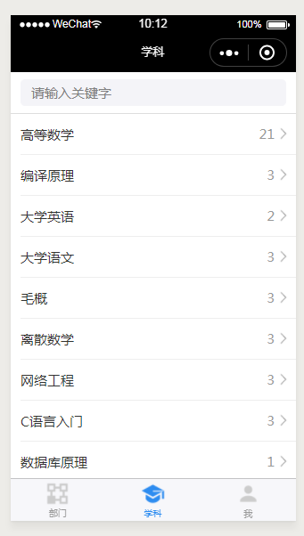
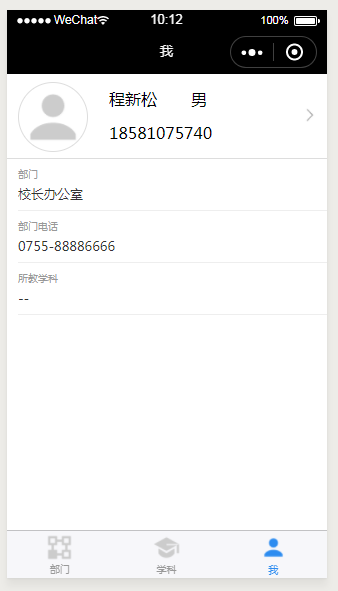

# wx_phoneBook
微信小程序-通讯录,是一个使用koa + mysql + nginx + ES6 + 微信小程序等技术栈的入门微信小程序开发的小项目。

这是一个完整的小项目，简化配置，本地就可以直接跑起来，对于入门小程序的开发人员用来学习和研究小程序的代码结构和语法有一定的帮助。

### 相关开发记录文章
[微信小程序初体验，入门练手项目--通讯录，后台是阿里云服务器(一)](https://www.mwcxs.top/page/440.html)
[微信小程序初体验，入门练手项目--通讯录，部署上线(二)](https://www.mwcxs.top/page/441.html)

### 技术栈
koa + mysql + nginx + ES6 + 微信小程序

### 源码地址
[https://github.com/saucxs/wx_phoneBook](https://github.com/saucxs/wx_phoneBook) 

### 演示地址(审核通过)
测试账号：18966667777 密码：test


### 版本功能
- [x] 登陆模块-使用手机号登陆
- [x] 部门分类模块-按照学校有不同的二级学院或者职能部门进行分类，查找相应的老师联系方式
- [x] 学科分类模块-按照老师所在的学科进行分类，查找相应的老师联系方式
- [x] 个人信息模块-登陆个人信息的查看以及修改

### 项目截图
#### 登陆模块

#### 部门模块

#### 学科模块

#### 个人模块



### 项目运行

```   
git clone https://github.com/saucxs/wx_phoneBook

cd wx_phoneBook

npm install

//运行后端服务
node api/app.js

//前台使用微信开发工具打开，编译

```

### 说明 
有啥问题请提issue
